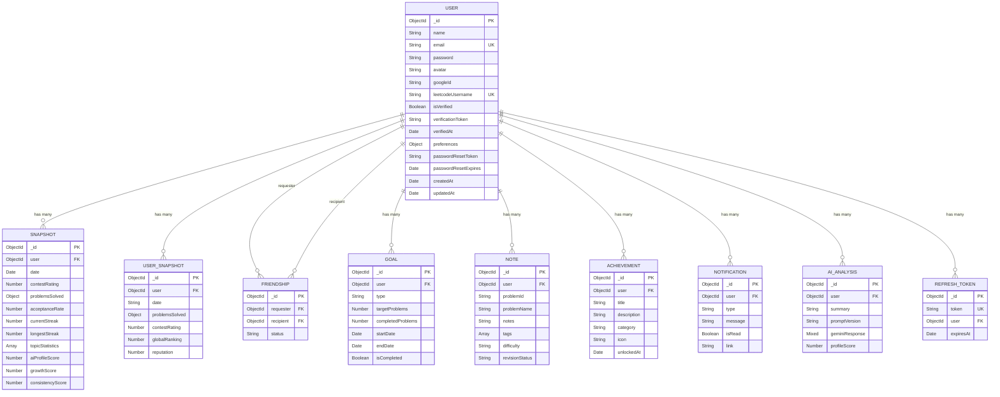

<p align="center">
  <h1 align="center">🔍 LeetLens</h1>
  <p align="center">
    <strong>A full-stack LeetCode analytics, comparison & social platform with AI-powered insights</strong>
  </p>
  <p align="center">
    <a href="#-tech-stack">Tech Stack</a> •
    <a href="#-high-level-system-architecture">Architecture</a> •
    <a href="#-database-architecture">Database</a> •
    <a href="#-authentication--security">Auth</a> •
    <a href="#-deployment-architecture">Deployment</a>
  </p>
</p>

---

## 📖 Overview

**LeetLens** is a full-stack platform that provides deep analytics, social comparison, and AI-powered coaching for LeetCode users. It consists of three independently deployable modules:

| Module | Description |
|--------|-------------|
| **`client/`** | React SPA — Dashboard, analytics charts, leaderboards, profile comparison, and friend management |
| **`server/`** | Express + TypeScript REST API — Authentication, data aggregation, AI analysis, cron-based snapshots, and PDF report generation |
| **`lcExtension/`** | Chrome Extension (Manifest V3) — Scrapes LeetCode profile data from the browser and relays it to the platform |

### Key Features

- 📊 **Rich Dashboard** — Problems solved breakdown (Easy/Medium/Hard), contest rating history, acceptance rate, streaks, and topic distribution radar charts
- 🆚 **Head-to-Head Comparison** — Compare your LeetCode stats side-by-side with any user
- 🏆 **Leaderboard** — Compete with friends and the community
- 🤖 **AI-Powered Analysis** — Get personalized coaching insights generated via OpenRouter (DeepSeek/Gemini)
- 📈 **Historical Snapshots** — Automated daily cron job captures progress over time
- 🎯 **Goal Tracking** — Set daily, weekly, or monthly problem-solving goals
- 📝 **Problem Notes** — Annotate problems with tags, difficulty, and revision status
- 🏅 **Achievements** — Unlock badges for milestones (problems, streaks, contests)
- 🔔 **Notifications** — Contest reminders, goal nudges, friend acceptances, and AI report readiness
- 📄 **PDF Reports** — Generate downloadable performance reports with PDFKit
- 🔐 **LeetCode Verification** — Bio-token verification to prove account ownership
- 🧩 **Chrome Extension** — Content script + background worker for in-browser LeetCode data extraction

---

## 🛠 Tech Stack

### Frontend (`client/`)

| Layer | Technology | Version |
|-------|-----------|---------|
| **UI Library** | React | 19 |
| **Language** | JavaScript (JSX) | ES2022+ |
| **Routing** | React Router DOM | v7 |
| **Styling** | Tailwind CSS | v4 |
| **Animations** | Framer Motion | v12 |
| **Charts** | Recharts | v3 |
| **HTTP Client** | Fetch API (with retry wrapper) | Native |
| **OAuth** | `@react-oauth/google` | v0.13 |
| **Icons** | React Icons | v5 |
| **Build Tool** | Vite | v8 |
| **Linting** | ESLint | v10 |
| **Type Checking** | TypeScript (via tsconfig) | — |

### Backend (`server/`)

| Layer | Technology | Version |
|-------|-----------|---------|
| **Runtime** | Node.js | 20+ |
| **Framework** | Express.js | v5 |
| **Language** | TypeScript | v6 |
| **Database** | MongoDB (via Mongoose) | v9 |
| **Cache / Token Store** | Redis (via ioredis) | v5 |
| **Authentication** | JWT (`jsonwebtoken`) + Google OAuth (`google-auth-library`) | — |
| **Password Hashing** | bcrypt | v6 |
| **Email** | Resend SDK | v6 |
| **AI Integration** | OpenRouter API (DeepSeek / Gemini) | REST |
| **PDF Generation** | PDFKit | v0.19 |
| **Cron Jobs** | node-cron | v4 |
| **API Docs** | Swagger (swagger-jsdoc + swagger-ui-express) | OpenAPI 3.0 |
| **Security** | Helmet, express-rate-limit, CORS, cookie-parser | — |
| **Logging** | Morgan | — |
| **Compression** | compression middleware | — |
| **Validation** | express-validator | v7 |
| **Dev Tooling** | Nodemon, ts-node | — |

### Chrome Extension (`lcExtension/`)

| Layer | Technology | Version |
|-------|-----------|---------|
| **Manifest** | Chrome Manifest V3 | 3 |
| **UI** | React + Tailwind CSS | 19 / v3 |
| **Icons** | Lucide React | v1 |
| **Charts** | Recharts | v3 |
| **Build Tool** | Vite + CRXJS Plugin | v8 / v2 beta |
| **Permissions** | `storage`, `activeTab`, `scripting` | — |
| **Host Permissions** | `*://leetcode.com/*` | — |

---

## 🏗 High-Level System Architecture

```
┌─────────────────────────────────────────────────────────────────────────┐
│                            USER / BROWSER                              │
│  ┌────────────────────┐           ┌──────────────────────────────────┐ │
│  │  Chrome Extension   │           │        React SPA (Client)        │ │
│  │  (Manifest V3)      │           │                                  │ │
│  │  ┌──────────────┐   │           │  ┌────────┐  ┌──────────────┐   │ │
│  │  │Content Script │   │           │  │ React  │  │  Framer      │   │ │
│  │  │(leetcode.com) │   │           │  │ Router │  │  Motion      │   │ │
│  │  └──────┬───────┘   │           │  └───┬────┘  └──────────────┘   │ │
│  │         │            │           │      │                          │ │
│  │  ┌──────▼───────┐   │           │  ┌───▼────────────────────┐     │ │
│  │  │  Background   │   │           │  │  ProfileContext        │     │ │
│  │  │  Service      │   │           │  │  (Global State)        │     │ │
│  │  │  Worker       │   │           │  └───┬────────────────────┘     │ │
│  │  └──────┬───────┘   │           │      │                          │ │
│  │         │            │           │  ┌───▼────────────────────┐     │ │
│  │  ┌──────▼───────┐   │           │  │  API Service Layer      │     │ │
│  │  │  Popup UI     │   │           │  │  (fetch + retry)        │     │ │
│  │  │  (React)      │   │           │  └───┬────────────────────┘     │ │
│  │  └──────────────┘   │           │      │                          │ │
│  └────────────────────┘           └──────┼──────────────────────────┘ │
│                                          │  HTTPS / REST              │
└──────────────────────────────────────────┼──────────────────────────────┘
                                           │
                            ┌──────────────▼──────────────────┐
                            │      Express.js API Server       │
                            │        (Node.js + TypeScript)    │
                            │                                  │
                            │  ┌────────────────────────────┐  │
                            │  │      Middleware Stack       │  │
                            │  │  Helmet → Morgan → Rate     │  │
                            │  │  Limiter → CORS → Body      │  │
                            │  │  Parser → Cookie Parser →   │  │
                            │  │  Compression                │  │
                            │  └─────────────┬──────────────┘  │
                            │                │                  │
                            │  ┌─────────────▼──────────────┐  │
                            │  │       Route Layer           │  │
                            │  │  /api/v1/auth               │  │
                            │  │  /api/v1/leetcode           │  │
                            │  │  /api/v1/friends            │  │
                            │  │  /api/v1/goals              │  │
                            │  │  /api/v1/notes              │  │
                            │  │  /api/v1/ai                 │  │
                            │  │  /api/v1/achievements       │  │
                            │  │  /api/v1/notifications      │  │
                            │  │  /api/v1/reports            │  │
                            │  └─────────────┬──────────────┘  │
                            │                │                  │
                            │  ┌─────────────▼──────────────┐  │
                            │  │   Controller → Service      │  │
                            │  │   (Business Logic Layer)    │  │
                            │  └──┬──────────┬───────────┬──┘  │
                            │     │          │           │      │
                            └─────┼──────────┼───────────┼──────┘
                                  │          │           │
                     ┌────────────▼──┐  ┌────▼────┐  ┌──▼──────────────┐
                     │   MongoDB     │  │  Redis  │  │  External APIs   │
                     │   Atlas       │  │ Upstash │  │                  │
                     │               │  │         │  │ • LeetCode GQL   │
                     │  (Mongoose    │  │ (Token  │  │ • OpenRouter AI  │
                     │   ODM)        │  │  Cache) │  │ • Resend Email   │
                     └───────────────┘  └─────────┘  └──────────────────┘
```

### Data Flow Summary

1. **User authenticates** via email/password or Google OAuth → server issues JWT access + refresh tokens
2. **Client fetches LeetCode data** by proxying GraphQL queries through the backend (`/api/v1/leetcode/graphql`) to avoid CORS
3. **ProfileContext** stores fetched data globally and triggers background AI analysis
4. **Daily cron job** (`node-cron`, midnight UTC) iterates all verified users, hits the LeetCode REST API, and persists a `Snapshot` document per user per day
5. **AI analysis** is requested on-demand — the server sends the user's profile data as a prompt to OpenRouter and stores the response in `AIAnalysis`
6. **PDF reports** are generated server-side via PDFKit using the latest snapshot + AI analysis data

---

## 🚀 Deployment Architecture

```
┌────────────────────────────────────────────────────────────┐
│                      PRODUCTION                            │
│                                                            │
│  ┌─────────────────────┐      ┌──────────────────────┐    │
│  │    Vercel (CDN)      │      │   Render (PaaS)       │    │
│  │                      │      │                        │    │
│  │  React SPA (client/) │ ──▶  │  Express API (server/) │    │
│  │  Static Build        │ API  │  Node.js Runtime       │    │
│  │                      │ Calls│                        │    │
│  │  • SPA Rewrites      │      │  • trust proxy = 1     │    │
│  │  • vercel.json       │      │  • Rate limiting       │    │
│  │  • Global CDN        │      │  • CORS (client URL)   │    │
│  └─────────────────────┘      └──────────┬─────────────┘    │
│                                          │                   │
│  ┌─────────────────────┐      ┌──────────▼─────────────┐    │
│  │  Chrome Web Store    │      │  MongoDB Atlas          │    │
│  │                      │      │  (Managed Cluster)      │    │
│  │  Chrome Extension    │      └──────────┬─────────────┘    │
│  │  (lcExtension/)      │                 │                   │
│  │                      │      ┌──────────▼─────────────┐    │
│  │  • Manifest V3       │      │  Upstash Redis          │    │
│  │  • Content Scripts   │      │  (Serverless, TLS)      │    │
│  │  • Background SW     │      └────────────────────────┘    │
│  └─────────────────────┘                                     │
│                                                              │
│  ┌──────────────────────────────────────────────────────┐   │
│  │                 External Services                      │   │
│  │  • OpenRouter API (AI / LLM)                           │   │
│  │  • Resend (Transactional Email)                        │   │
│  │  • LeetCode GraphQL API (Data Source)                  │   │
│  │  • Google OAuth (Identity Provider)                    │   │
│  └──────────────────────────────────────────────────────┘   │
└────────────────────────────────────────────────────────────┘
```

| Component | Platform | Config |
|-----------|----------|--------|
| **Frontend** | Vercel | SPA rewrites via `vercel.json` — all routes redirect to `index.html` |
| **Backend** | Render | Node.js service, auto-deploys from Git, `trust proxy` enabled for rate-limit headers |
| **Database** | MongoDB Atlas | Managed cluster, connection via `MONGO_URI` env variable |
| **Cache** | Upstash Redis | Serverless Redis with auto-TLS upgrade (`rediss://`), used for token management |
| **Email** | Resend | Transactional emails for password reset (sender: `onboarding@resend.dev`) |
| **AI** | OpenRouter | Chat completions API, configurable model (default: `deepseek/deepseek-chat`) |
| **Extension** | Chrome Web Store | Manifest V3, built with Vite + CRXJS |

---

## 🔐 Authentication & Security

### Authentication Flow

LeetLens implements a **dual-token JWT architecture** with both access and refresh tokens:

```
┌──────────┐     Register / Login / Google OAuth      ┌────────────┐
│  Client   │ ──────────────────────────────────────▶  │   Server   │
│           │                                          │            │
│           │  ◀──── { accessToken, refreshToken } ──  │  AuthSvc   │
│           │         + HttpOnly cookie (jwt)          │            │
│           │                                          │            │
│  localStorage                                        │  MongoDB   │
│  ┌──────────────┐                                    │  ┌──────┐  │
│  │ accessToken  │                                    │  │Refresh│  │
│  └──────────────┘                                    │  │Token  │  │
│                                                      │  │Model  │  │
│  Every API Request:                                  │  └──────┘  │
│  Authorization: Bearer <accessToken>                 │            │
│                                                      │            │
│  Token Expired?                                      │            │
│  POST /api/v1/auth/refresh                           │            │
│  { refreshToken } ──────────────────────────────▶    │  Rotate    │
│  ◀──── { newAccessToken, newRefreshToken } ────      │  Tokens    │
└──────────┘                                          └────────────┘
```

### Token Details

| Token | Storage | Lifetime | Purpose |
|-------|---------|----------|---------|
| **Access Token** | `localStorage` | 15 minutes (configurable via `JWT_ACCESS_EXPIRES_IN`) | Authorize API requests via `Bearer` header |
| **Refresh Token** | `HttpOnly` cookie + `RefreshToken` MongoDB collection | 7 days (configurable via `JWT_REFRESH_EXPIRES_IN`) | Rotate expired access tokens |

### Security Measures

| Measure | Implementation |
|---------|----------------|
| **Password Hashing** | bcrypt with 12 salt rounds (pre-save hook on User model) |
| **Helmet** | Sets secure HTTP headers (XSS, CSP, Clickjacking protection) |
| **Rate Limiting** | 1000 requests per IP per hour on `/api/*` routes |
| **CORS** | Strict origin allowlist (`CLIENT_URL` env variable) |
| **HttpOnly Cookies** | Refresh token stored in HttpOnly cookie (not accessible via JS) |
| **Secure Cookies** | `secure: true` and `sameSite: 'none'` in production |
| **Body Size Limit** | `express.json({ limit: '10kb' })` prevents payload abuse |
| **Token Rotation** | Old refresh tokens are deleted on use (prevents reuse attacks) |
| **TTL Index** | `RefreshToken` collection has a MongoDB TTL index for automatic expiry cleanup |
| **Global Error Handler** | Environment-aware error responses (stack traces in dev, sanitized in prod) |

### LeetCode Account Verification

Users must verify their LeetCode account ownership through a **bio-token challenge**:

1. Server generates a unique token: `LL-<8 random hex chars>` (e.g., `LL-A3F2B1C9`)
2. User adds the token to their LeetCode profile bio
3. Server fetches the user's bio via LeetCode GraphQL API
4. If the token is found in the bio → account is marked as **verified**

### Supported Auth Methods

| Method | Endpoint | Flow |
|--------|----------|------|
| **Email + Password** | `POST /api/v1/auth/register` / `login` | Traditional registration with bcrypt hashing |
| **Google OAuth** | `POST /api/v1/auth/google-login` | Client-side Google sign-in → server verifies and creates/links user |
| **Password Reset** | `POST /api/v1/auth/forgot-password` → `PATCH /api/v1/auth/reset-password/:token` | Email-based reset flow via Resend |
| **Logout** | `POST /api/v1/auth/logout` | Invalidates refresh token |
| **Logout All Devices** | `POST /api/v1/auth/logout-all` | Deletes all refresh tokens for the user |

---

## 🛡 Role-Based Routing & Access Control

### Route Protection Architecture

LeetLens uses a **middleware-based access control** pattern. The `protect` middleware verifies the JWT token and attaches the authenticated user to the request object:

```
Request ──▶ protect middleware ──▶ Route Handler
               │
               ├─ Extract token (Bearer header OR cookie)
               ├─ Verify JWT signature
               ├─ Fetch user from DB
               └─ Attach user to req.user
```

### Route Access Matrix

| Route Group | Auth Required | Middleware | Endpoints |
|-------------|:------------:|------------|-----------|
| **Auth (Public)** | ❌ | — | `POST /register`, `POST /login`, `POST /google-login`, `POST /forgot-password`, `PATCH /reset-password/:token` |
| **Auth (Protected)** | ✅ | `protect` | `POST /verify-leetcode`, `POST /refresh`, `POST /logout`, `POST /logout-all` |
| **LeetCode (Public)** | ❌ | — | `POST /leetcode/graphql` (proxy) |
| **LeetCode (Protected)** | ✅ | `protect` | `POST /leetcode/snapshot`, `GET /leetcode/history`, `POST /leetcode/verify` |
| **Friends** | ✅ | `router.use(protect)` | `GET /`, `POST /request`, `PATCH /request/:id`, `DELETE /:id` |
| **Goals** | ✅ | `router.use(protect)` | `GET /`, `POST /`, `PATCH /:id`, `DELETE /:id` |
| **Notes** | ✅ | `router.use(protect)` | `GET /`, `POST /`, `PATCH /:id`, `DELETE /:id` |
| **AI** | ✅ | `router.use(protect)` | `GET /`, `POST /`, `GET /latest`, `POST /generate` |
| **Achievements** | ✅ | `router.use(protect)` | `GET /` |
| **Notifications** | ✅ | `router.use(protect)` | `GET /`, `GET /unread-count`, `PATCH /mark-all-read`, `PATCH /:id/read` |
| **Reports** | ✅ | `router.use(protect)` | `GET /pdf` |
| **API Docs** | ❌ | — | `GET /api-docs` (Swagger UI) |
| **Health Check** | ❌ | — | `GET /api/health` |

### Client-Side Routing

The React client uses **React Router v7** with the following page structure, all nested under a shared `Layout` component:

| Path | Component | Auth |
|------|-----------|:----:|
| `/` | `Home` | Public |
| `/dashboard` | `Dashboard` | Authenticated |
| `/compare` | `Compare` | Authenticated |
| `/analytics` | `Analytics` | Authenticated |
| `/leaderboard` | `Leaderboard` | Authenticated |
| `/history` | `History` | Authenticated |
| `/profile` | `Profile` | Authenticated |
| `/login` | `Login` | Guest |
| `/signup` | `Signup` | Guest |
| `/verify` | `Verification` | Authenticated |
| `/forgot-password` | `ForgotPassword` | Guest |
| `/reset-password/:token` | `ResetPassword` | Guest |
| `*` | 404 Page | Public |

---

## 🗄 Database Architecture

### Overview

LeetLens uses **MongoDB** (via Mongoose ODM) as its primary data store and **Upstash Redis** as a caching / session layer.

### Entity-Relationship Diagram



### Collections Reference

| Collection | Description | Key Indexes |
|-----------|-------------|-------------|
| **`users`** | Core user accounts with auth credentials and preferences | `email` (unique), `googleId` (sparse), `leetcodeUsername` (unique, sparse) |
| **`snapshots`** | Daily automated snapshots from the cron job with enriched analytics fields | `{ user, date }` (compound unique) |
| **`usersnapshots`** | Client-initiated snapshots saved on dashboard load | `{ user, date }` (compound unique) |
| **`friendships`** | Bi-directional friend request system with status tracking | `{ requester, recipient }` (compound unique) |
| **`goals`** | Time-boxed problem-solving goals with automatic completion detection | `user` (indexed) |
| **`notes`** | Per-problem study notes with tags and revision status | `user` (indexed) |
| **`achievements`** | Unlocked milestones and badges | `{ user, title }` (compound unique) |
| **`notifications`** | In-app notifications with read/unread tracking | `user` (indexed) |
| **`aianalyses`** | AI-generated profile analysis reports from OpenRouter | `user` (indexed) |
| **`refreshtokens`** | JWT refresh tokens with automatic TTL expiry | `token` (unique), `{ expiresAt }` (TTL index) |

### Redis Usage

| Purpose | Details |
|---------|---------|
| **Connection** | Upstash Redis with auto-TLS upgrade (`redis://` → `rediss://`) |
| **Config** | `maxRetriesPerRequest: 3`, `family: 0` for DNS compatibility |
| **Use Cases** | Token caching, rate limiting support, session-adjacent data |

---

## ⚙️ Environment Variables

### Server (`server/.env`)

| Variable | Description |
|----------|-------------|
| `PORT` | Server port (default: `5000`) |
| `NODE_ENV` | `development` or `production` |
| `MONGO_URI` | MongoDB Atlas connection string |
| `REDIS_URI` / `REDIS_URL` | Redis connection string (Upstash) |
| `JWT_ACCESS_SECRET` | Secret for signing access JWTs |
| `JWT_REFRESH_SECRET` | Secret for signing refresh JWTs |
| `JWT_ACCESS_EXPIRES_IN` | Access token lifetime (e.g., `15m`) |
| `JWT_REFRESH_EXPIRES_IN` | Refresh token lifetime in days (e.g., `7`) |
| `CLIENT_URL` | Frontend URL for CORS and email links |
| `GOOGLE_CLIENT_ID` | Google OAuth client ID |
| `OPENROUTER_API_KEY` | API key for OpenRouter (AI) |
| `OPENROUTER_MODEL` | LLM model identifier (default: `deepseek/deepseek-chat`) |
| `RESEND_API_KEY` | API key for Resend (transactional email) |

### Client (`client/.env`)

| Variable | Description |
|----------|-------------|
| `VITE_API_URL` | Backend API base URL |
| `VITE_GOOGLE_CLIENT_ID` | Google OAuth client ID |

---

## 🚀 Getting Started

### Prerequisites

- **Node.js** ≥ 20
- **npm** ≥ 10
- **MongoDB** (Atlas or local)
- **Redis** (Upstash or local)

### Installation

```bash
# Clone the repository
git clone https://github.com/your-username/LeetLens.git
cd LeetLens

# Install server dependencies
cd server
npm install

# Install client dependencies
cd ../client
npm install

# Install extension dependencies
cd ../lcExtension
npm install
```

### Running Locally

```bash
# Terminal 1 — Start the backend
cd server
npm run dev          # Runs with nodemon + ts-node on port 5000

# Terminal 2 — Start the frontend
cd client
npm run dev          # Runs Vite dev server on port 5173
```

### Building for Production

```bash
# Build the server
cd server
npm run build        # Compiles TypeScript → dist/

# Build the client
cd client
npm run build        # Vite production build → dist/

# Build the Chrome extension
cd lcExtension
npm run build        # Vite + CRXJS build → dist/
```

---

## 📡 API Documentation

Interactive API docs are available via **Swagger UI** when the server is running:

```
http://localhost:5000/api-docs
```

### API Endpoints Summary

| Module | Base Path | Methods |
|--------|-----------|---------|
| Auth | `/api/v1/auth` | `POST` register, login, google-login, verify-leetcode, refresh, logout, logout-all, forgot-password; `PATCH` reset-password |
| LeetCode | `/api/v1/leetcode` | `POST` graphql, verify, snapshot; `GET` history |
| Friends | `/api/v1/friends` | `GET` list; `POST` request; `PATCH` respond; `DELETE` remove |
| Goals | `/api/v1/goals` | `GET` list; `POST` create; `PATCH` update; `DELETE` remove |
| Notes | `/api/v1/notes` | `GET` list; `POST` create; `PATCH` update; `DELETE` remove |
| AI | `/api/v1/ai` | `GET` reports, latest; `POST` save, generate |
| Achievements | `/api/v1/achievements` | `GET` list |
| Notifications | `/api/v1/notifications` | `GET` list, unread-count; `PATCH` mark-read, mark-all-read |
| Reports | `/api/v1/reports` | `GET` pdf |
| Health | `/api/health` | `GET` status check |

---

## 📁 Project Structure

```
LeetLens/
├── client/                          # React SPA (Frontend)
│   ├── src/
│   │   ├── components/              # Reusable UI components
│   │   │   ├── Analytics/           # Analytics-specific components
│   │   │   ├── Comparison/          # Comparison view components
│   │   │   ├── Profile/             # Profile section components
│   │   │   ├── charts/              # Recharts wrappers
│   │   │   ├── common/              # Shared/generic components
│   │   │   └── layout/              # Layout shell (Navbar, Sidebar, etc.)
│   │   ├── context/                 # React Context providers
│   │   │   └── ProfileContext.jsx   # Global profile & analytics state
│   │   ├── lib/                     # Analytics computation library
│   │   ├── mockData/                # Mock data for development
│   │   ├── pages/                   # Route-level page components
│   │   ├── services/                # API communication layer
│   │   │   └── api.js               # LeetCode GraphQL proxy + REST calls
│   │   └── utils/                   # Helper utilities
│   ├── vercel.json                  # Vercel SPA rewrite config
│   ├── vite.config.js               # Vite build configuration
│   └── package.json
│
├── server/                          # Express.js API (Backend)
│   ├── src/
│   │   ├── config/                  # DB, Redis, and Swagger config
│   │   │   ├── db.ts                # MongoDB connection (Mongoose)
│   │   │   ├── redis.ts             # Redis connection (ioredis + Upstash TLS)
│   │   │   └── swagger.ts           # OpenAPI 3.0 docs setup
│   │   ├── controllers/             # Request handlers
│   │   ├── cron/                    # Scheduled jobs
│   │   │   └── snapshotJob.ts       # Daily midnight snapshot cron
│   │   ├── middleware/              # Express middleware
│   │   │   ├── authMiddleware.ts    # JWT verification (protect)
│   │   │   └── errorHandler.ts      # Global error handler
│   │   ├── models/                  # Mongoose schemas & models
│   │   ├── routes/                  # Express route definitions
│   │   ├── services/                # Business logic services
│   │   │   ├── ai.service.ts        # OpenRouter AI integration
│   │   │   ├── auth.service.ts      # JWT generation & refresh logic
│   │   │   ├── leetcode.service.ts  # LeetCode GraphQL client
│   │   │   └── report.service.ts    # PDF report generation (PDFKit)
│   │   ├── utils/                   # Helpers (AppError, sendEmail)
│   │   ├── validators/              # Request validation schemas
│   │   ├── app.ts                   # Express app setup & middleware chain
│   │   └── server.ts                # Entry point (DB connect + cron start)
│   └── package.json
│
├── lcExtension/                     # Chrome Extension (Manifest V3)
│   ├── src/
│   │   ├── background/              # Service worker
│   │   ├── content/                 # Content scripts (leetcode.com)
│   │   ├── components/              # Extension popup components
│   │   ├── graphql/                 # GraphQL query definitions
│   │   ├── services/                # Data fetching services
│   │   ├── storage/                 # Chrome storage helpers
│   │   └── utils/                   # Extension utilities
│   ├── manifest.json                # Chrome Manifest V3 config
│   └── package.json
│
└── .gitignore
```

---

